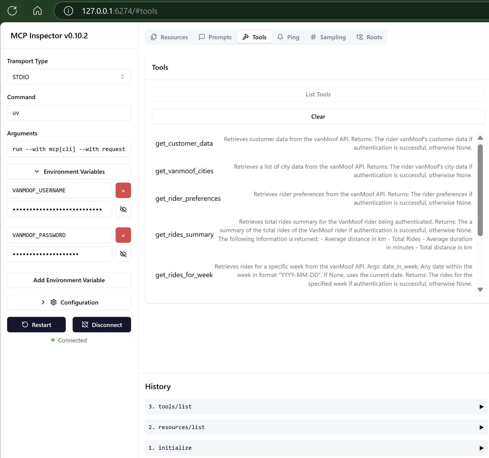

# 🚲VanMoof MCP Server

The VanMoof MCP Server implements the [MCP specification](https://modelcontextprotocol.io) to create a seamless connection between AI agents and key VanMoof services like VanMoof customer data, including bike details, VanMoof rider cities, rider preferences and weekly rides.

## 🎯 Overview

### ✨ What can you do with the VanMoof MCP Server?

The VanMoof MCP Server supercharges your agents with VanMoof rider context. Here are some cool prompts you can try:

### 🔍 Explore your customer data

- "Give me my VanMoof bike details, please."
- "What is the name of my VanMoof's bike?"
- "What is the frame number of my VanMoof's bike?"
- "What is the color of my VanMoof's bike?"

### 🏙️ Cities Rides

- "In which cities in the world are VanMoof rides tracked?"
- "Create a table of the cities in the Netherlands where VanMoof rides are tracked with longitude and latitude columns"  
  "Retrieves a list of cities in the Netherlands where VanMoof rides are tracked and formats them into a table with columns for longitude and latitude."

### ⚙️ Your rider preferences

- "Get my VanMoof's rider preferences"
- "Which city is configured in my VanMoof's rider preference?"

### 🚲 Explore your VanMoof's rides

- "Give me my weekly ride stats for 2025-03-25 on my VanMoof"
- "What was my top speed on my VanMoof's bike?"
- "What was my longest ride on my VanMoof's bike?"
- "What are the city statistics of today's week?"
- "What are the world's bike statistics of today's week?"
- "Compare the world statistics with the city statistics. What can you conclude?"
- "Compare my weekly VanMoof ride statistics with the city and world bike statistics. Store the results in markdown table for the comparison."

## 🛠️ Currently Supported Tools

- get_customer_data: Retrieves customer data from the VanMoof autenticated user
- get_vanmoof_cities: Retrieves a list of city data from the VanMoof API.
- get_rider_preferences: Retrieves rider preferences from the VanMoof autenticated user.
- get_rides_summary: Retrieves total rides summary from the VanMoof autenticated user.
- get_rides_for_week(date_in_week: str = ""): Retrieves rides for a specific week from the VanMoof autenticated user.
- get_city_rides_thisweek: Retrieves total city rides summary from VanMoof riders in this week.
- get_world_rides_thisweek: Retrieves total world rides summary from VanMoof riders in this week.


## 🔌 Getting Started

### Install Python

The VanMoof MCP Server requires Python. If you have not it installed, follow the instructions [here](https://wiki.python.org/moin/BeginnersGuide/Download).

### Install uv 
Also install [uv](https://docs.astral.sh/uv/). This an extremely fast Python package and project manager, written in Rust. Follow the instruction [here](https://docs.astral.sh/uv/#installation) to install uv.

### Clone MCP-SERVER-VANMOOF Github Repository.

run below command in your terminal:

```pwsh
git clone https://github.com/stefanstranger/mcp-server-vanmoof
```

### Test and debug VanMoof MCP Server

The MCP inspector is a developer tool for testing and debugging MCP servers.

Before local debugging and testing configure the .env file with your VanMoof credentials.

Rename the .env-example file to .env and configure your VanMoof credentials.

Run the following to test and debug the VanMoof MCP Server:

```bash
mcp dev c:\github\mcp-server-vanmoof\server.py
```

Configure the following arguments:

run --with mcp[cli] --with requests --with tzlocal mcp run c://github//mcp-server-vanmoof//server.py

And the Environment Arguments for VANMOOF_USERNAME and VANMOOF_PASSWORD in the Webbrowser after you have started the MCP inspector.



#### Launching MCP Inspector

There are two ways to launch MCP Inspector:

- Launch with MCP CLI
- Launch with npx @modelcontextprotocol/inspector

If you install the SDK with the cli option like uv add "mcp[cli]", you can use the MCP CLI. To start MCP Inspector, run mcp dev.

## 🔧 Setup

### Usage with Claude Desktop

Add the following to your claude_desktop_config.json file:
```json
{
  "mcpServers": {
    "mcp-server-vanmoof": {
            "type": "stdio",
            "command": "uv",
            "args": [
              "run",
              "--with",
              "mcp[cli]",
              "--with",
              "requests",
              "--with",
              "tzlocal",
              "mcp",
              "run",
              "C:\\Github\\mcp-server-vanmoof\\server.py"
            ],
            "env": {
              "VANMOOF_USERNAME": "john.doe@outlook.com",
              "VANMOOF_PASSWORD": "[VanMoof user account password]"
            }
        }
  }
}
```

## 🛡️ Security Note

Your VanMoof credentials are stored as plain text in the MCP Client configurations. Don't share these with others!!

## References
- [Create Model Context Protocol (MCP) server projects with no build configuration](https://github.com/modelcontextprotocol/create-python-server)
- [MCP Inspector](https://github.com/modelcontextprotocol/inspector)